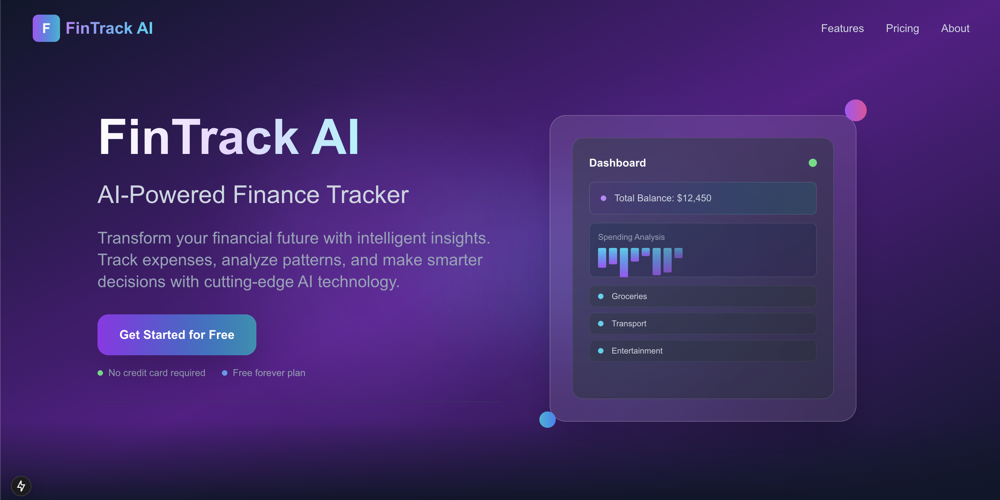
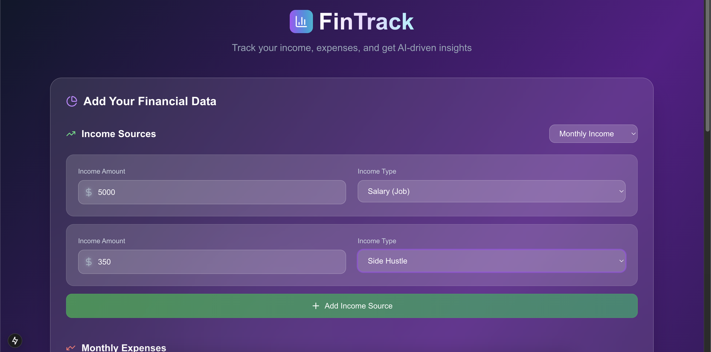
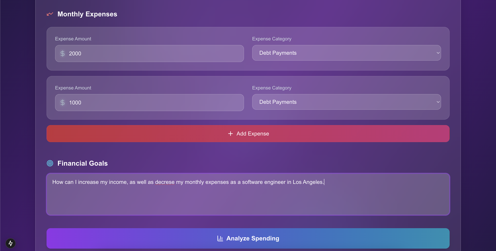
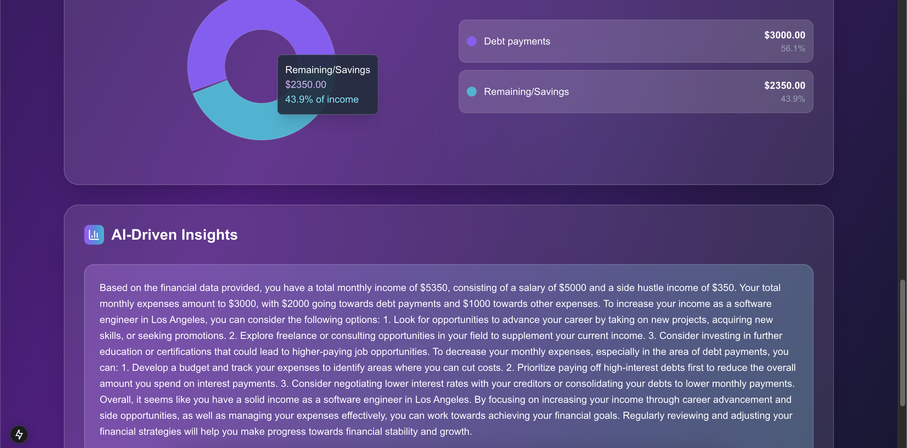

# 📊 FinTrack - AI-Powered Finance Tracker

**FinTrack** is an AI-powered finance tracker that helps users manage their **monthly income, expenses, and financial goals**. It leverages **OpenAI's API** to provide intelligent insights and suggestions to improve budgeting and achieve financial success.

## Features
-  **Track Monthly Income & Expenses**
-  **Set and Manage Financial Goals**
-  **AI-Driven Insights** on spending habits and budget improvements
-  **Modern UI** using **Next.js** and **Tailwind CSS**
-  **FastAPI Backend** for efficient API handling

##  Demo Pictures:






##  Tech Stack
- **Frontend:** [Next.js](https://nextjs.org/) + [Tailwind CSS](https://tailwindcss.com/)
- **Backend:** [FastAPI](https://fastapi.tiangolo.com/)
- **AI Processing:** [OpenAI API](https://openai.com/api/)


##  Installation & Setup
### **1️ Clone the Repository**
```bash
git clone https://github.com/your-username/FinTrack.git
cd FinTrack
```

### **2️ Set Up the Backend (FastAPI)**
```bash
cd backend
python -m venv venv
source venv/bin/activate  # On Windows use `venv\Scripts\activate`
pip install -r requirements.txt
```

Create a `.env` file in the `backend/` folder and add your OpenAI API key:
```
OPENAI_API_KEY=your-openai-api-key
```

Start the FastAPI server:
```bash
uvicorn main:app --reload
```

### **3️ Set Up the Frontend (Next.js)**
```bash
cd ../src
npm install
npm run dev
```

Your app should now be running at **http://localhost:3000**.

##  Usage
1. Enter your **income and expenses**.
2. Set **financial goals**.
3. Click **Analyze Spending**.
4. View **AI-generated insights** to improve financial health.

##  API Endpoints
| Method | Endpoint                | Description                     |
|--------|-------------------------|---------------------------------|
| POST   | `/api/analyze-spending` | Processes financial insights    |

##  Future Improvements
-  **Visual Charts** for spending trends
-  **Notifications** for savings goals
-  **Historical Data Analysis**

##  Contributors
- **Chris Alpuerto** ([GitHub](https://github.com/chrisalpuerto))

---
 **Start tracking your finances with AI-powered insights today!**

